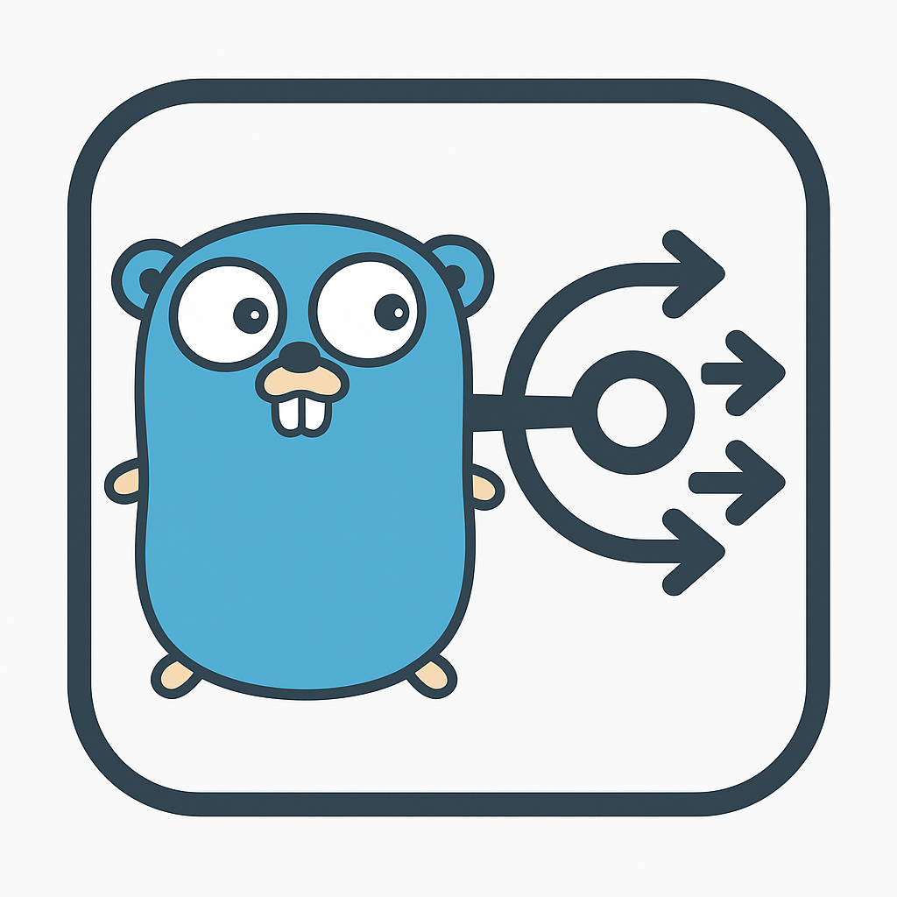

<p align="center">
  
</p>
<h1 align="center">Go EventBus</h1>
<p align="center">
  <strong>一个高性能、支持泛型的 Go 事件驱动架构库</strong>
</p>


[](https://golang.org/)
[](https://pkg.go.dev/github.com/PlutoWu-Cn/go-bus)
[](LICENSE)
[](https://goreportcard.com/report/github.com/PlutoWu-Cn/go-bus)
[](https://github.com/PlutoWu-Cn/go-bus)


一个现代化的、高性能的 Go 事件总线实现，支持泛型、异步处理、优先级、过滤器等企业级功能。

[English Documentation](README.md)

## ✨ 特性

### 🔧 核心功能
- **类型安全**: 使用 Go 泛型确保编译时类型安全
- **同步/异步**: 支持同步和异步事件处理
- **Handle 模式**: 支持精确的订阅取消
- **一次性订阅**: 支持只触发一次的事件处理器

### 🚀 企业级功能
- **优先级处理**: 支持 4 级优先级（Critical, High, Normal, Low）
- **事件过滤**: 支持自定义过滤器
- **上下文支持**: 支持 context.Context 取消和超时
- **中间件**: 支持事件处理中间件链
- **错误处理**: 完善的错误处理和恢复机制
- **监控指标**: 内置性能监控和统计
- **优雅关闭**: 支持优雅关闭和资源清理

### 🔒 可靠性
- **并发安全**: 线程安全设计
- **Panic 恢复**: 自动恢复处理器 panic
- **资源管理**: 自动资源清理和内存管理

## 📦 安装

```bash
go get github.com/PlutoWu-Cn/go-bus
```

## 🚀 快速开始

### 基本使用

```go
package main

import (
    "fmt"
    "github.com/PlutoWu-Cn/go-bus"
)

type UserEvent struct {
    UserID string
    Action string
}

func main() {
    // 创建类型安全的事件总线
    eventBus := bus.NewTyped[UserEvent]()
    defer eventBus.Close()

    // 订阅事件
    handle := eventBus.SubscribeWithHandle("user.login", func(event UserEvent) {
        fmt.Printf("用户 %s 执行了 %s\n", event.UserID, event.Action)
    })
    defer handle.Unsubscribe()

    // 发布事件
    eventBus.Publish("user.login", UserEvent{
        UserID: "user123",
        Action: "login",
    })
}
```

## 📖 详细使用

### 优先级处理

不同优先级的处理器会按优先级顺序执行：

```go
// 高优先级 - 安全检查
securityHandle := eventBus.SubscribeWithPriority("user.action", func(event UserEvent) {
    fmt.Println("🔒 安全检查")
}, bus.PriorityCritical)

// 普通优先级 - 业务逻辑
businessHandle := eventBus.SubscribeWithPriority("user.action", func(event UserEvent) {
    fmt.Println("📋 业务处理")
}, bus.PriorityNormal)

// 低优先级 - 统计分析
analyticsHandle := eventBus.SubscribeWithPriority("user.action", func(event UserEvent) {
    fmt.Println("📊 数据统计")
}, bus.PriorityLow)
```

### 事件过滤

只处理符合条件的事件：

```go
// 只处理管理员用户的事件
adminHandle := eventBus.SubscribeWithFilter("user.action", func(event UserEvent) {
    fmt.Printf("管理员操作: %s\n", event.UserID)
}, func(topic string, event UserEvent) bool {
    return strings.HasPrefix(event.UserID, "admin_")
})

// 只处理敏感操作
sensitiveHandle := eventBus.SubscribeWithFilter("user.action", func(event UserEvent) {
    fmt.Printf("敏感操作告警: %s\n", event.Action)
}, func(topic string, event UserEvent) bool {
    sensitiveActions := []string{"delete", "modify_permissions"}
    for _, action := range sensitiveActions {
        if event.Action == action {
            return true
        }
    }
    return false
})
```

### 上下文控制

使用 context 进行取消和超时控制：

```go
// 上下文取消
ctx, cancel := context.WithCancel(context.Background())
handle := eventBus.SubscribeWithContext(ctx, "user.session", func(event UserEvent) {
    fmt.Printf("会话事件: %s\n", event.UserID)
})

// 取消订阅
cancel()

// 超时发布
err := eventBus.PublishWithTimeout("user.action", event, 5*time.Second)
if err != nil {
    fmt.Printf("发布超时: %v\n", err)
}
```

### 错误处理

设置全局错误处理器：

```go
eventBus.SetErrorHandler(func(err *bus.EventError) {
    log.Printf("事件处理错误 - 主题: %s, 错误: %v", err.Topic, err.Err)
})
```

### 中间件

添加处理中间件：

```go
// 日志中间件
eventBus.AddMiddleware(func(topic string, event interface{}, next func()) error {
    start := time.Now()
    log.Printf("开始处理事件: %s", topic)
    
    next() // 执行处理器
    
    log.Printf("事件处理完成: %s, 耗时: %v", topic, time.Since(start))
    return nil
})

// 限流中间件
eventBus.AddMiddleware(func(topic string, event interface{}, next func()) error {
    if rateLimiter.Allow() {
        next()
        return nil
    }
    return fmt.Errorf("rate limit exceeded")
})
```

### 监控指标

获取运行时指标：

```go
metrics := eventBus.GetMetrics()
published, processed, failed, subscribers := metrics.GetStats()

fmt.Printf("发布事件: %d\n", published)
fmt.Printf("处理事件: %d\n", processed)
fmt.Printf("失败事件: %d\n", failed)
fmt.Printf("活跃订阅者: %d\n", subscribers)

// 获取主题信息
topics := eventBus.GetTopics()
subscriberCount := eventBus.GetSubscriberCount("user.action")
```

### 异步处理

```go
// 异步处理，非事务性（并发执行）
err := eventBus.SubscribeAsync("user.notification", func(event UserEvent) {
    sendEmail(event.UserID)
}, false)

// 异步处理，事务性（串行执行）
err := eventBus.SubscribeAsync("user.audit", func(event UserEvent) {
    writeAuditLog(event)
}, true)
```

## 🏗️ 架构设计

该库采用模块化设计，提高了代码的可维护性：

### 文件结构

- **`types.go`** - 核心类型定义（Priority、EventError、过滤器、中间件）
- **`interfaces.go`** - 接口定义（BusSubscriber、BusPublisher、BusController、Bus）
- **`metrics.go`** - 监控和指标功能
- **`handle.go`** - 订阅句柄管理和内部处理器结构
- **`bus.go`** - 核心 EventBus 实现

### 接口分离

```go
// 订阅者接口
type BusSubscriber[T any] interface {
    Subscribe(topic string, fn func(T)) error
    SubscribeWithPriority(topic string, fn func(T), priority Priority) *Handle[T]
    SubscribeWithFilter(topic string, fn func(T), filter EventFilter[T]) *Handle[T]
    SubscribeWithContext(ctx context.Context, topic string, fn func(T)) *Handle[T]
    // ...
}

// 发布者接口
type BusPublisher[T any] interface {
    Publish(topic string, event T)
    PublishWithContext(ctx context.Context, topic string, event T) error
    PublishWithTimeout(topic string, event T, timeout time.Duration) error
}

// 控制器接口
type BusController interface {
    GetMetrics() *EventMetrics
    SetErrorHandler(handler ErrorHandler)
    AddMiddleware(middleware EventMiddleware[any])
    Close() error
    // ...
}
```

### 类型系统

```go
// 事件过滤器
type EventFilter[T any] func(topic string, event T) bool

// 事件中间件
type EventMiddleware[T any] func(topic string, event T, next func()) error

// 错误处理器
type ErrorHandler func(err *EventError)

// 优先级
type Priority int
const (
    PriorityLow Priority = iota
    PriorityNormal
    PriorityHigh
    PriorityCritical
)
```

## 🔧 最佳实践

### 1. 事件设计模式

参考业界最佳实践，支持以下事件设计模式：

#### Event Notification（事件通知）
```go
type UserCreatedEvent struct {
    UserID    string    `json:"user_id"`
    Timestamp time.Time `json:"timestamp"`
    // 最小化数据，订阅者自行获取详细信息
}
```

#### Event-Carried State Transfer（状态传输）
```go
type UserUpdatedEvent struct {
    UserID       string                 `json:"user_id"`
    Timestamp    time.Time              `json:"timestamp"`
    OldState     map[string]interface{} `json:"old_state"`
    NewState     map[string]interface{} `json:"new_state"`
    ChangedFields []string              `json:"changed_fields"`
}
```

### 2. 命名约定

```go
// 使用点分层级命名
"user.created"
"user.updated"
"user.deleted"
"order.placed"
"order.cancelled"
"payment.processed"
"payment.failed"

// 或使用命名空间
"ecommerce.order.created"
"auth.user.login"
"notification.email.sent"
```

### 3. 错误处理策略

```go
// 设置重试机制
eventBus.SetErrorHandler(func(err *EventError) {
    switch err.Err.(type) {
    case *TemporaryError:
        // 临时错误，稍后重试
        retryQueue.Add(err.Topic, err.Event)
    case *PermanentError:
        // 永久错误，记录并告警
        logger.Error("Permanent error", err)
        alerting.Send(err)
    default:
        // 未知错误，记录详情
        logger.Warn("Unknown error", err)
    }
})
```

### 4. 性能优化

```go
// 使用异步处理非关键路径
eventBus.SubscribeAsync("analytics.track", func(event UserEvent) {
    // 非关键的数据统计
    analytics.Track(event)
}, false)

// 关键路径使用同步处理
eventBus.Subscribe("payment.validate", func(event PaymentEvent) {
    // 关键的支付验证
    validatePayment(event)
})

// 使用过滤器减少不必要的处理
eventBus.SubscribeWithFilter("user.activity", handler, func(topic string, event UserEvent) bool {
    return event.IsImportant() // 只处理重要事件
})
```

## 🔍 与其他库的对比

| 特性 | go-bus | Guava EventBus | RxJava | Node.js EventEmitter |
|------|---------|----------------|---------|---------------------|
| 类型安全 | ✅ 泛型 | ✅ | ✅ | ❌ |
| 异步处理 | ✅ | ❌ | ✅ | ✅ |
| 优先级 | ✅ | ❌ | ❌ | ❌ |
| 过滤器 | ✅ | ❌ | ✅ | ❌ |
| 中间件 | ✅ | ❌ | ✅ | ❌ |
| 错误处理 | ✅ | ⚠️ | ✅ | ⚠️ |
| 监控指标 | ✅ | ❌ | ❌ | ❌ |
| 上下文支持 | ✅ | ❌ | ❌ | ❌ |

## 🧪 测试

运行完整测试套件：

```bash
go test -v ./...
```

生成测试覆盖率报告：

```bash
go test -cover ./...
go test -coverprofile=coverage.out ./...
go tool cover -html=coverage.out -o coverage.html
```

**当前测试覆盖率：92.2%** - 我们保持高测试覆盖率以确保可靠性和稳定性。

运行性能测试：

```bash
go test -bench=. -benchmem
```

## 📈 性能

基于 Go 1.19+ 的基准测试结果：

- **同步发布**: ~2,000,000 events/sec
- **异步发布**: ~5,000,000 events/sec
- **内存使用**: 极低的 GC 压力
- **并发性能**: 优秀的多核扩展性

## 🤝 贡献

欢迎提交 Issue 和 Pull Request！

1. Fork 这个仓库
2. 创建你的特性分支 (`git checkout -b feature/amazing-feature`)
3. 提交你的改动 (`git commit -m 'Add amazing feature'`)
4. 推送到分支 (`git push origin feature/amazing-feature`)
5. 开启一个 Pull Request

## 📄 许可证

MIT License - 详见 [LICENSE](LICENSE) 文件

## 🙏 致谢

本项目参考了以下优秀的开源项目和设计模式：

- [Guava EventBus](https://github.com/google/guava) - Java 生态的经典实现
- [MBassador](https://github.com/bennidi/mbassador) - 高性能 Java EventBus
- [Node.js EventEmitter](https://nodejs.org/api/events.html) - JavaScript 原生事件系统
- [Enterprise Integration Patterns](https://www.enterpriseintegrationpatterns.com/) - 企业集成模式 